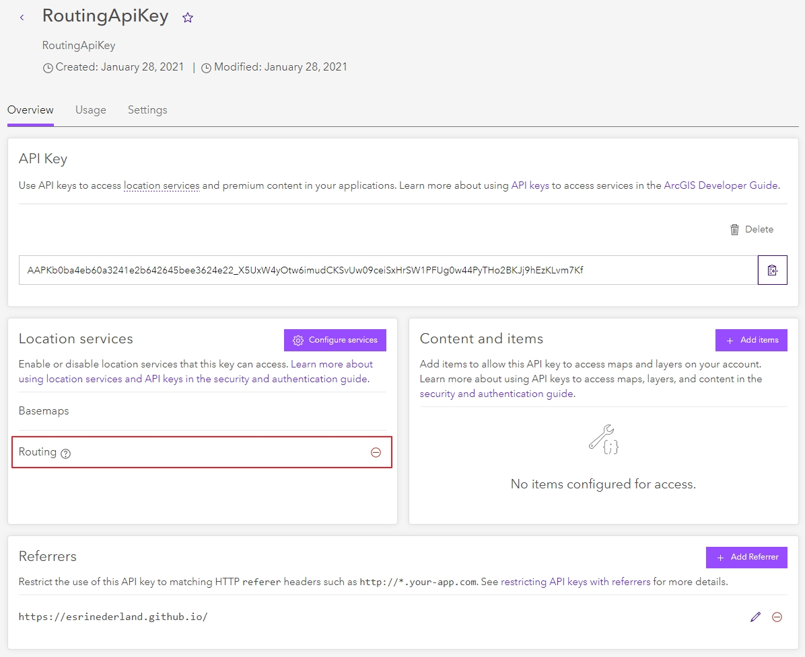
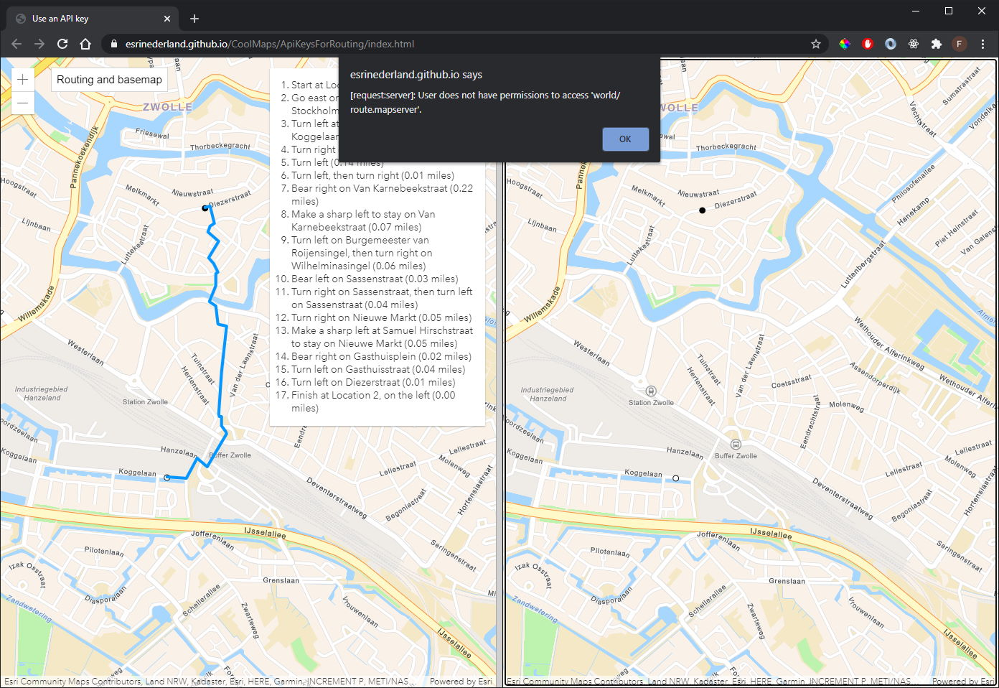

# Use of the new API keys
Since the release of ArcGIS Platform, Esri supports the use of API keys for accessing basemaps, geocoding and routing services and in the near future even your own secured services. On top of that it's also possible to use the Location Based Services in other (open source) front ends than the ones built with our own JavaScript API.
 
The API keys you create with your developer account can be set to support various operations. They always support the use of basemaps, but on top of that you can choose which capability to enable with each specific API key. Furthermore you can define a referer so the key can only be used from a spcific URL.

  
In this sample we have two identical applications, that each use a specific API key. The one on the left has both basemaps and routing capabilities enabled, the one on the right only basemaps. When you try to route on the right hand map, it will preset an error stating that the user has no permissions to access the routing service.

 
 
View this example live:
[here](https://esrinederland.github.io/CoolMaps/ApiKeysForRouting/index.html)
