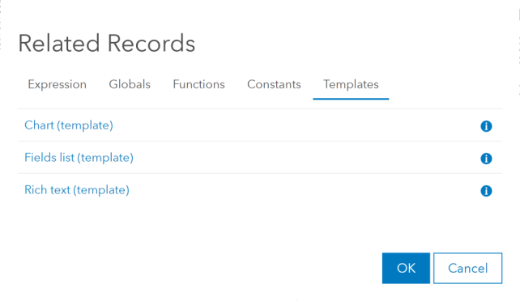
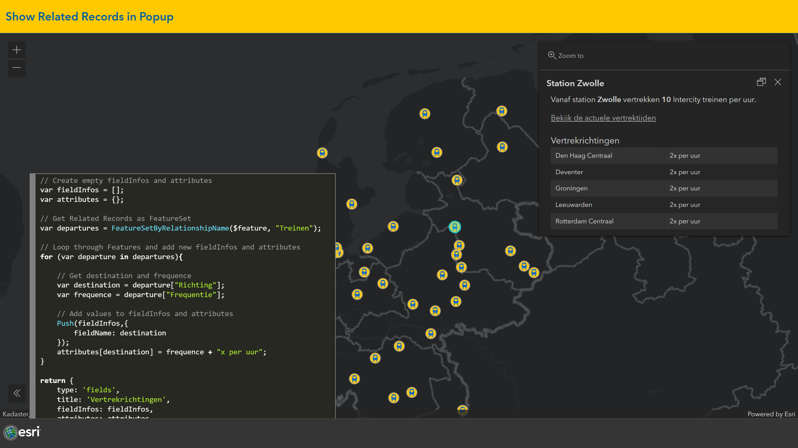

# Show Related Records in Popup with Arcade
This sample shows how to use Arcade to show Related Record information in the Popup.
 
 
When a one-to-many relationship exists between Feature Layers in ArcGIS, you want to be able to show the related information within a <i>Fields list</i> in the Popup. As the number of Related Records can vary between Features, it is not possible to define one <i>Fields list</i> that will fit all records.
 
 
Within the MapViewer it is possible to create Popup Elements using Arcade expressions. In the Arcade Editor you can use one of the Templates to create a <i>Chart</i>, <i>Fields list</i>, or <i>Rich text</i> Element. 
 
 

 
 
With the Arcade Function `FeatureSetByRelationshipName()` it is possible to retrieve all Related Records for the selected Feature. Using this FeatureSet the Fields in the <i>Fields list</i> can be created dynamically, adding one Field for each Related Record.
 
 
In the example below the Map shows a Feature Layer with all NS Intercity Stations. This layer has a Related Table with information about the departure directions and corresponding frequence for each station. The Popup contains a <i>Fields list</i>, created with Arcade, showing the records from the Related Table. 
 
 

 
 
View this example live:
[here](https://esrinederland.github.io/CoolMaps/ArcadeRelatedRecords)

