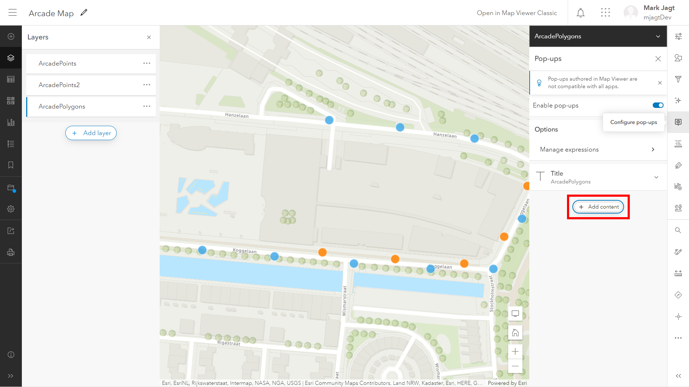
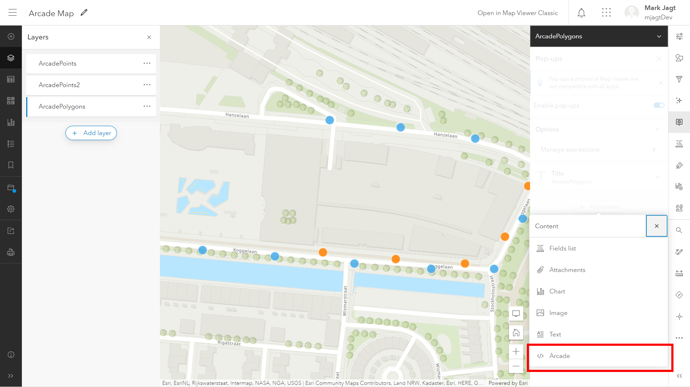
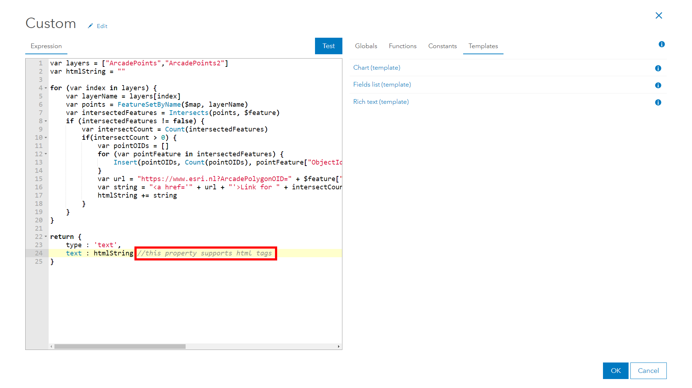
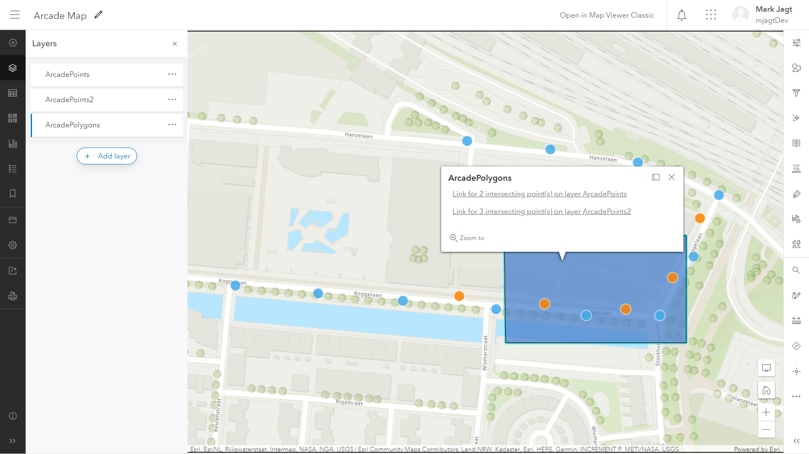

# Return HTML with Arcade
This sample shows how to use Arcade to create HTML content for the Popup.
 
In this case Arcade is used to get points that intesect with a polygon, and create a link for each layer in the map. This can be used to for example trigger an Azure HTTPTrigger Function.
 
 
These are the steps that need to be taken in the MapViewer. Note: this doesn't work in the MapViewer Classic.
 
 

 

 

 

 
 
View this example live (draw a polygon on the map to test the intersect function):
[here](https://esrinederland.github.io/CoolMaps/ArcadeReturnHtml)

