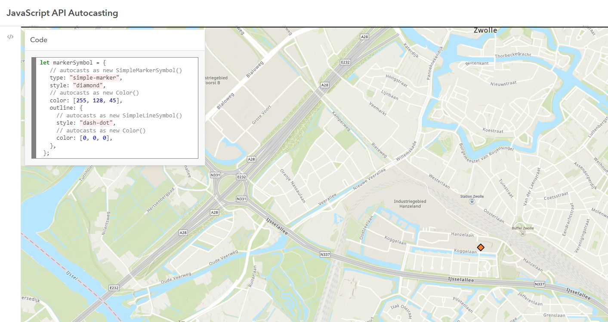

# Autocasting

This sample app shows the concept of autocasting.

Not all modules need to be imported when certain properties contain the correct value.
Properties supporting autocasting are indicated in the documentation with the autocast label.

## App

 
 
View this example live:
[here](https://esrinederland.github.io/CoolMaps/Autocasting/autocasting.html?ref=readme)
