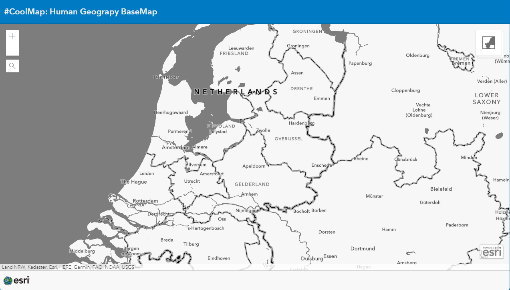

# Human Geography Basemap
This sample shows the new (since ArcGIS JS 4.25) basemaps: the Human Geography Basemap. This basemap shows borders, roads, etc... instead of topography.

View this example live:
[here](https://esrinederland.github.io/CoolMaps/BaseMaps/HumanGeographyBasemap.html?ref=readme)
