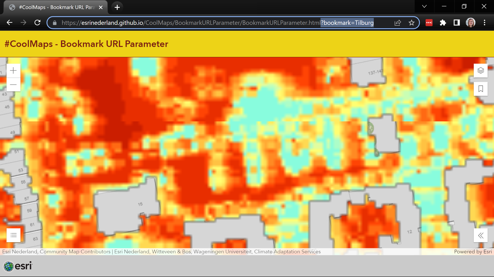

# Use a URL Parameter to set the initial Viewpoint to a specific Bookmark
This sample shows how to use Bookmarks to set the initial Viewpoint in your View, using a URL parameter. The <i>bookmark</i> URL parameter can be used to reference the name of an existing Bookmark. The Viewpoint will be retrieved from the specified Bookmark to update the View before rendering.
 
 
 

 
 
View this example live:
[here](https://esrinederland.github.io/CoolMaps/BookmarkURLParameter/BookmarkURLParameter.html)
