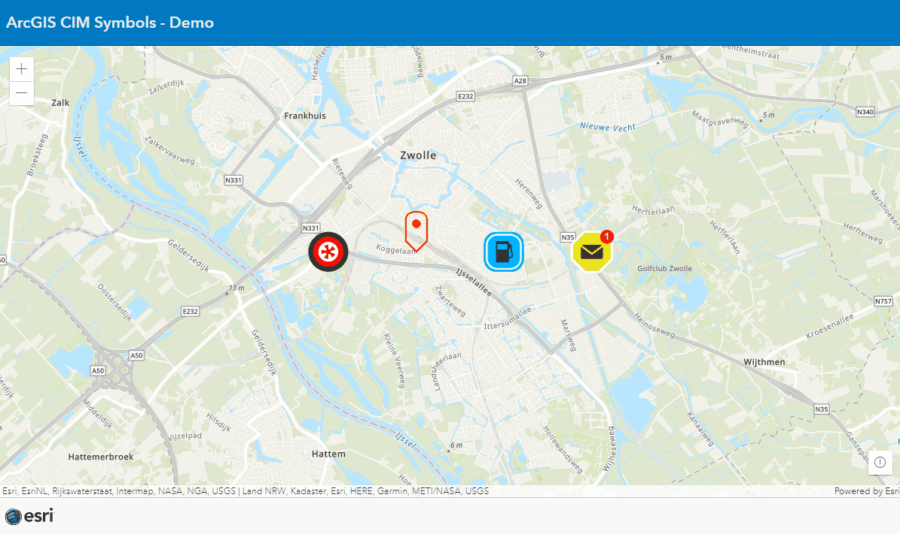

# CIM Symbols Demo

## Complex Symbols with CIMSymbology

This samples shows a few options of the [```CIMSymbols```](https://developers.arcgis.com/javascript/latest/api-reference/esri-symbols-CIMSymbol.html) in the [ArcGIS JS API.](https://developers.arcgis.com/javascript/latest/)
<br>
<br>
View this example live:
[here](https://esrinederland.github.io/CoolMaps/CIMSymbols)
<br>
<br>
These symbols were created with the 
[CIM Symbol Builder](https://esri.github.io/cim-symbol-builder-js/)


