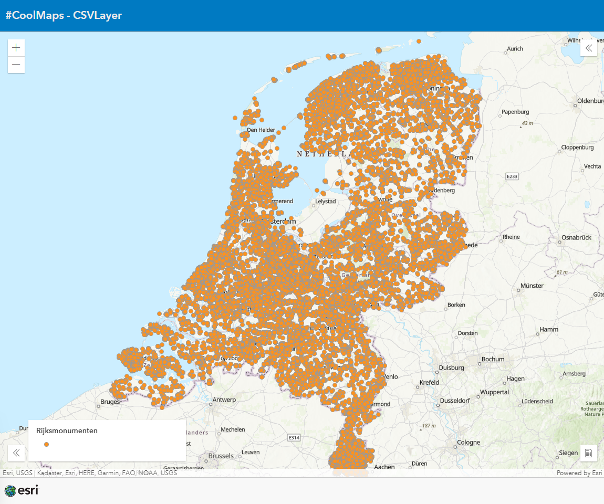

# CSVLayer 

This samples shows add a CSV (with lat/lon information) to a map in just 2 lines of code.
 
 
View this example live:
[here](https://esrinederland.github.io/CoolMaps/CSVLayer/CSVLayer.html)

