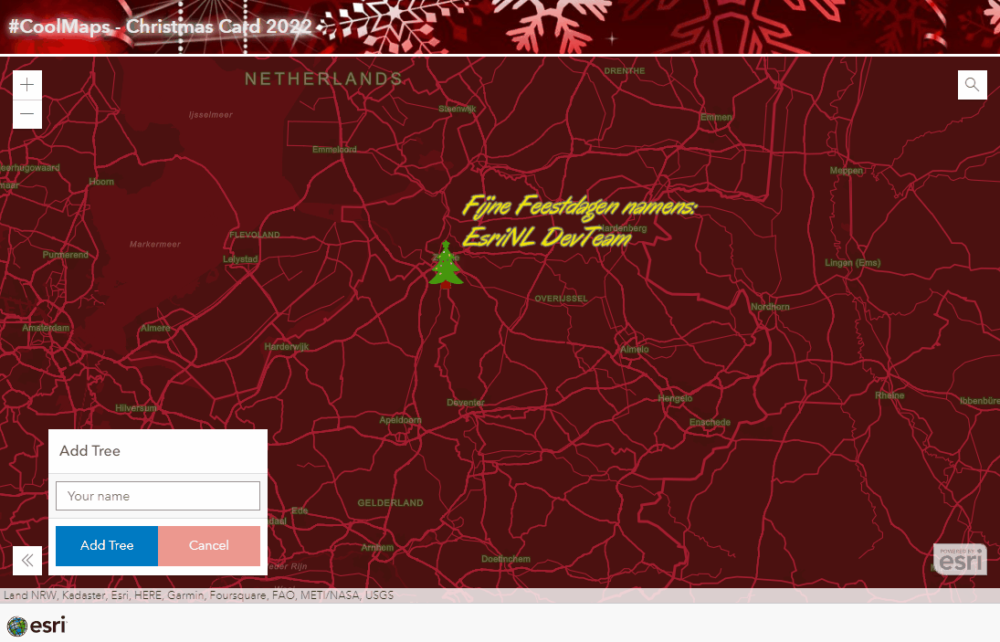

# Christmas 2021

## Christmas 2022
View this example live: 
[here](https://esrinederland.github.io/CoolMaps/Christmas/Christmas2022.html?ref=readme)

Add your own christmas tree and leave a christmas greeting for the rest of the world!

---

## Christmas 2021

View this example live: 
[here](https://esrinederland.github.io/CoolMaps/Christmas/2021.html?ref=readme)

To create your own christmas tree you need to click on the "Create a tree" button and click on a place on the map. 
Delete the tree by clicking on the "Clear tree" button. 
If you want to save your tree in the Service click the "Save Tree" button, give your tree a name and it will saved. 
 
 
