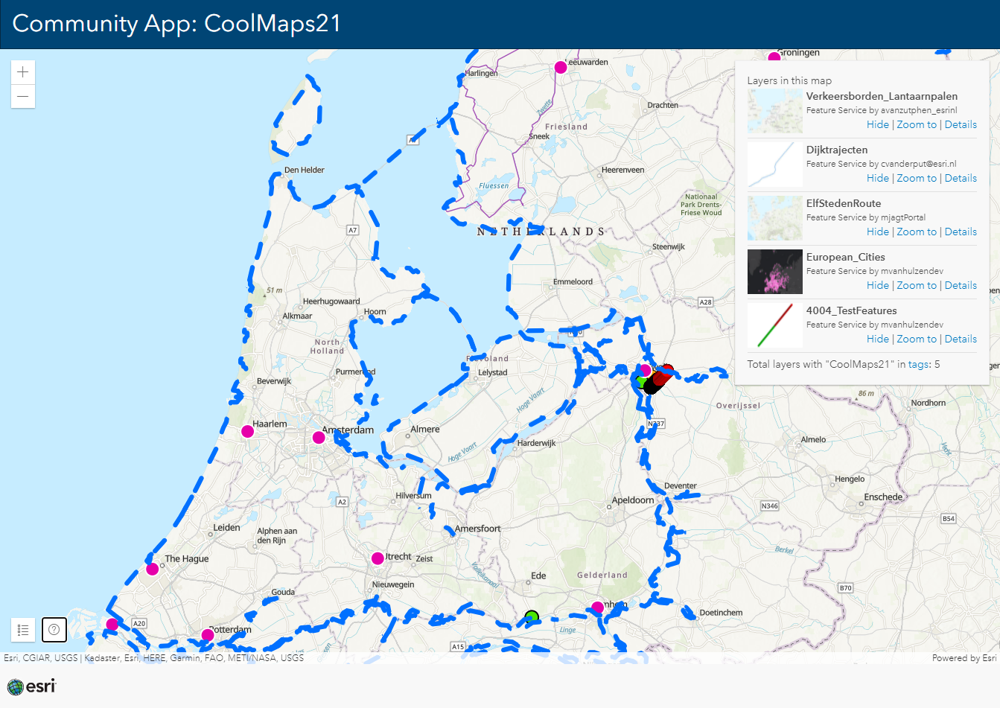

# Community App: CoolMaps21

This sample is showing the power of content management with ArcGIS. With tags your application be dynamic without losing functionality.

The app loads the 10 most recently modified publicly available FeatureLayers from ArcGIS Online with the tag: CoolMaps21.

 
 
View this example live:
[here](https://esrinederland.github.io/CoolMaps/CommunityApp/index.html)
