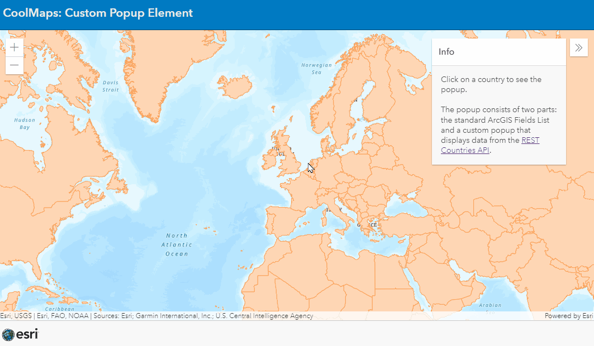

# Custom popup

## Custom Content popup Element

This samples shows how to add a custom popup element to a popup using a [CustomContent](https://developers.arcgis.com/javascript/latest/api-reference/esri-popup-content-CustomContent.html).

 
 
View this example live:
[here](https://esrinederland.github.io/CoolMaps/CustomPopup/CustomPopupElement.html)

