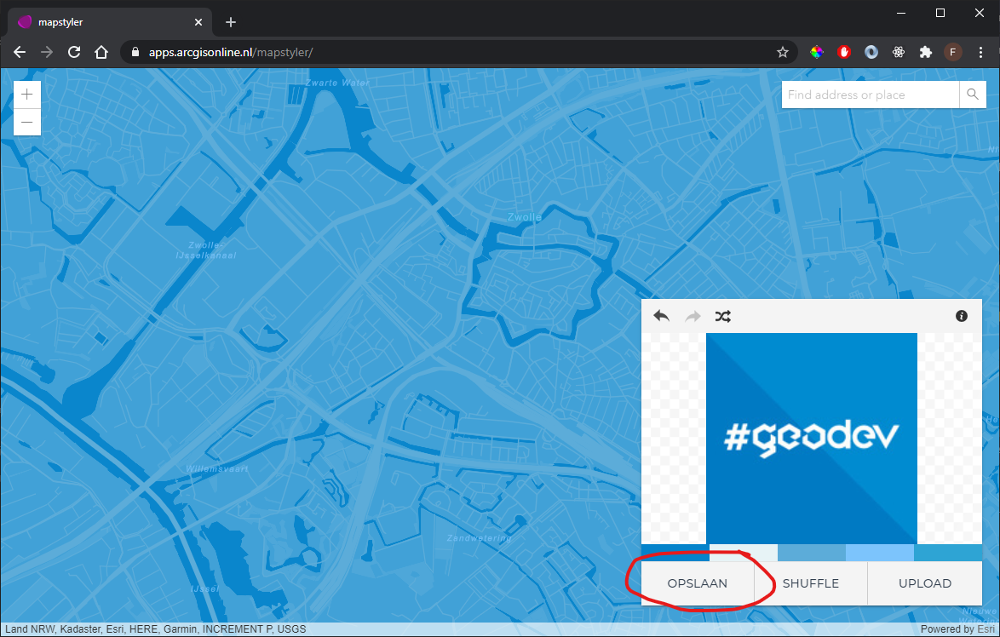

# Custom Styled Vector Basemap

This sample app shows the use of a Custom Styled Vector Basemap.

 
 
So how do you create and use a styled vector basemap?
 
First you create a custom styled vector basemap using the [MapStyler](https://apps.arcgisonline.nl/mapstyler/) or by hand (https://www.youtube.com/watch?v=IY8TmN607b4&ab_channel=EsriEvents). When you're happy with the MapStyler result click "opslaan" (save).

 
 
When you save the map using the MapStyler app you're prompted to sign in. Use your ArcGIS Platform account for this! The custom styled basemap will now be saved there.

 
 
Navigate to https://developers.arcgis.com and sign in with your ArcGIS Platform account. Add a new API key and click the button "Add items" at "Content and Items".

 
 
Choose the styled basemap you just saved in the MapStyler and click "Add 1 item".

 
 
Navigate to https://www.arcgis.com and sign in with your ArcGIS Platform account. Go to "My Content" and find the styled basemap you just saved in the MapStyler. Copy the item id you find in the url.

 
 
Open your favorit IDE, use the code from this repo and paste the copied item id at the "portalItem:id". Also add the API key you've just created.

 
 
Lean back and enjoy the miracle you've just created ;)
 
 
View this example live:
[here](https://esrinederland.github.io/CoolMaps/CustomStyledBasemap/index.html)
