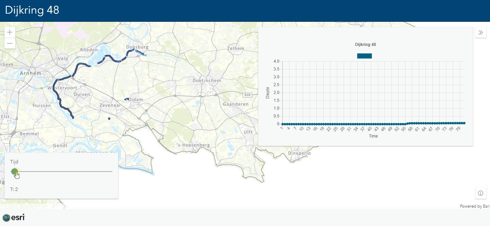

# Dijkring 48

In this sample app shows data from more than 10 000 000 datapoints.

The data is filtered and compressed into 100 000 points with 81 fields.

 
 
View this example live:
[here](https://esrinederland.github.io/CoolMaps/Dijkring48/index.html)
