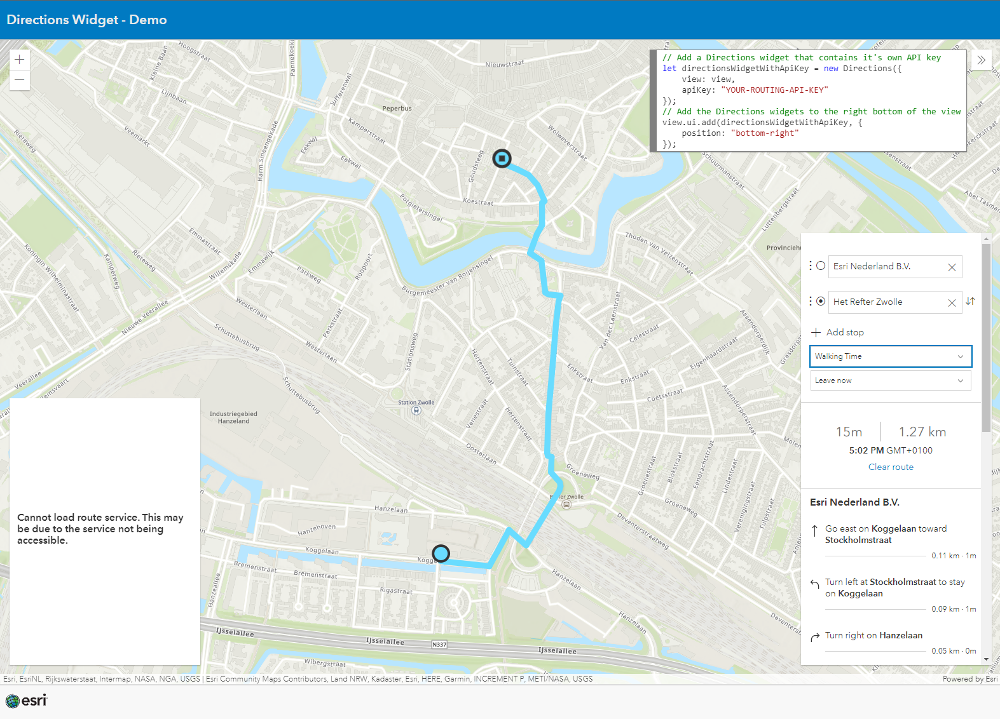

# Directions Widget with API key

## Use a specific API key with the Directions Widget

This samples shows how to use the Directions widget with a specific API key. This way you don't need to use the same API key that you use for loading the basemaps. This makes it possible to differentiate between API keys which provides more possibilities in tracking usage or granting/revoking capabilities for different users (in your own user management).
 
 
In the example you see that there's also a Directions widget added on the left hand side that does not contain it's own API key. And because the general API key used on the page doesn't support routing, the widget doesn't work.
 
 
View this example live:
[here](https://esrinederland.github.io/CoolMaps/DirectionsWidget/index.html)

