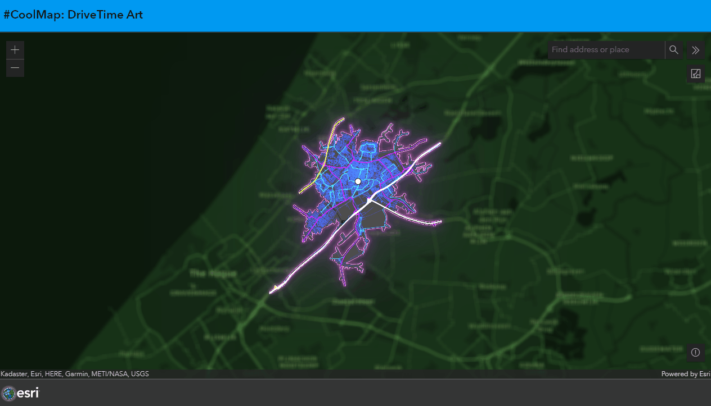

# DriveTimeArt
This sample shows the 10 minute drive time from a point you click (or your search result) on the map.
  
It is also possible to create an image from the map to use as a background.

 
 
Try this example example live:
[here](https://esrinederland.github.io/CoolMaps/DriveTimeArt/DriveTimeArt.html)

---

To learn more about "Drive Time Polygons" or "Service Areas" [Service areas](https://developers.arcgis.com/documentation/mapping-apis-and-services/routing/service-areas/)

