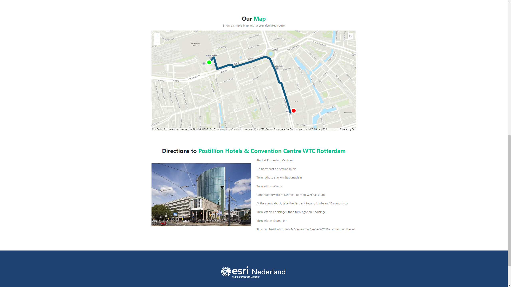

# Embedded Map with Route

This sample shows how to display a simple map with a precalculated route on your website. The route is created using the ArcGIS MapViewer and saved as a new RouteLayer. This layer can be accessed through the Portal Item to extract the route's geometry and directions. 
 
 
Use the ArcGIS API for JavaScript to embed a map and your route information on your own website. The ID of the portalItem in <i>arcgis-map.js</i> can be changed to display information from your own RouteLayer. 

 
 

View this example live:
[here](https://esrinederland.github.io/CoolMaps/EmbeddedMapWithRoute/index.html?ref=readme)
