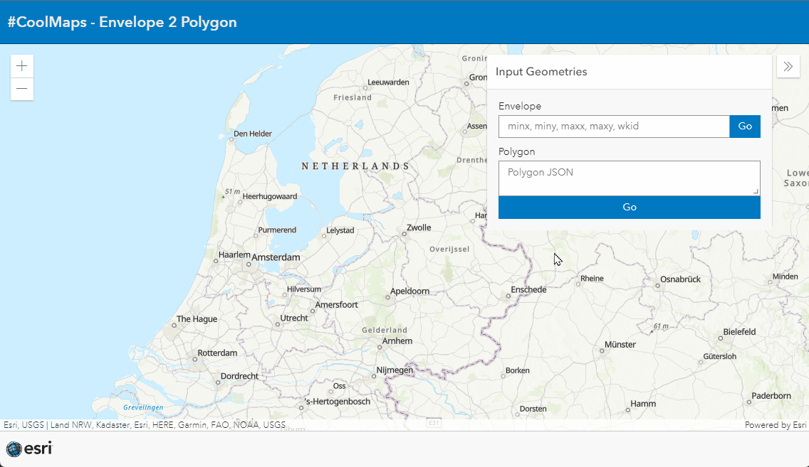

# Envelope 2 Polygon
This app visualizes an extent (envelope) based on xmin, ymin, xmax, ymax.

See the live example [here](https://esrinederland.github.io/CoolMaps/Envelope2Polygon/Envelope2Polygon.html)