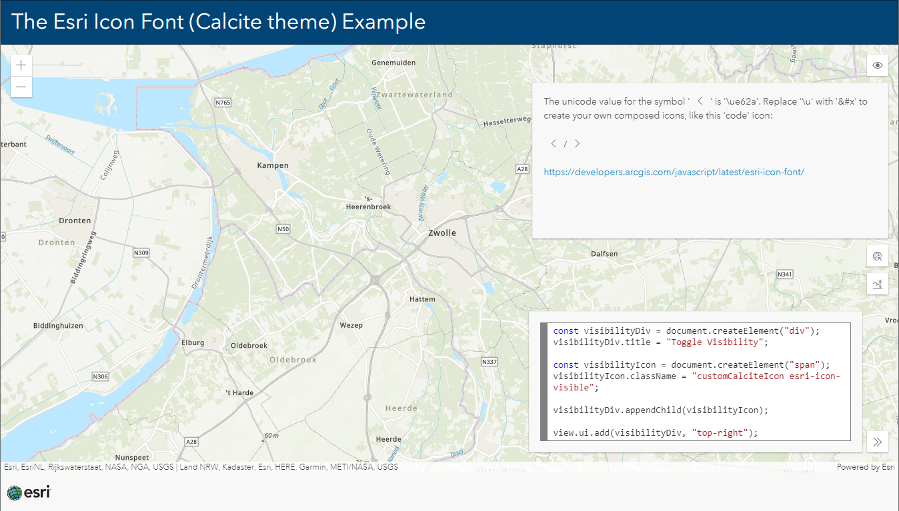

# The Esri Icon Font (Calcite theme) Example

This sample shows how to use the Esri Icon Font to create custom buttons with an "ArcGIS look and feel".

The Esri Icon Font is a monochromatic icon set used at Esri for a consistent Esri branded theme.

Icon fonts have several advantages such as the ability to quickly change their color, and the fact that icon fonts can size themselves to be proportional to text placed with them.

 
 
View this example live:
[here](https://esrinederland.github.io/CoolMaps/EsriIconFont/)

Learn more about the Esri Icon Font [here](https://developers.arcgis.com/javascript/latest/esri-icon-font/)