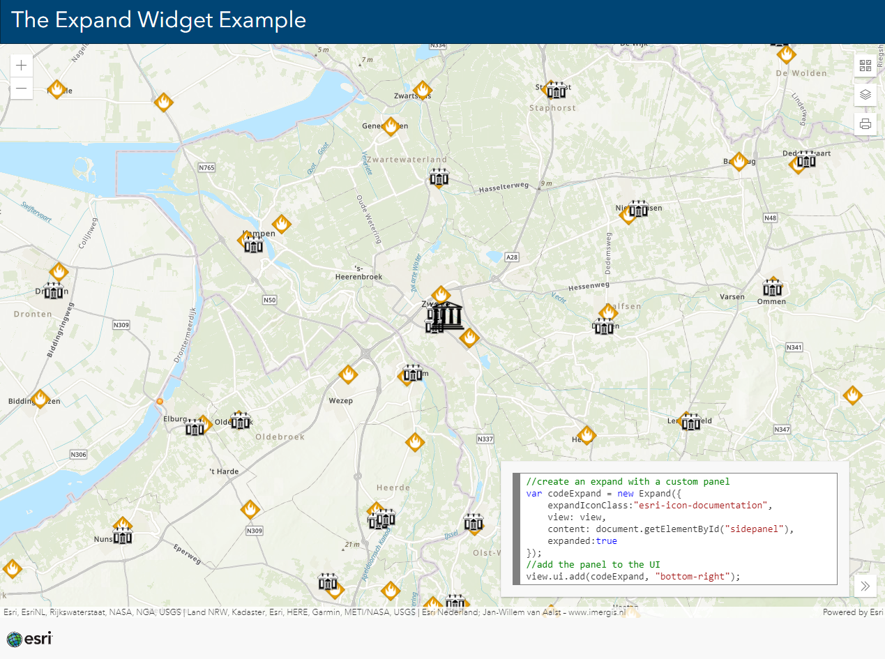

# The Expand Widget Example

This sample shows how you can use the Expand Widget with a JS API Widget or with your own panel.

 
 
View this example live:
[here](https://esrinederland.github.io/CoolMaps/ExpandWidget/)

Learn more about the Expand widget [here](https://developers.arcgis.com/javascript/latest/api-reference/esri-widgets-Expand.html)
