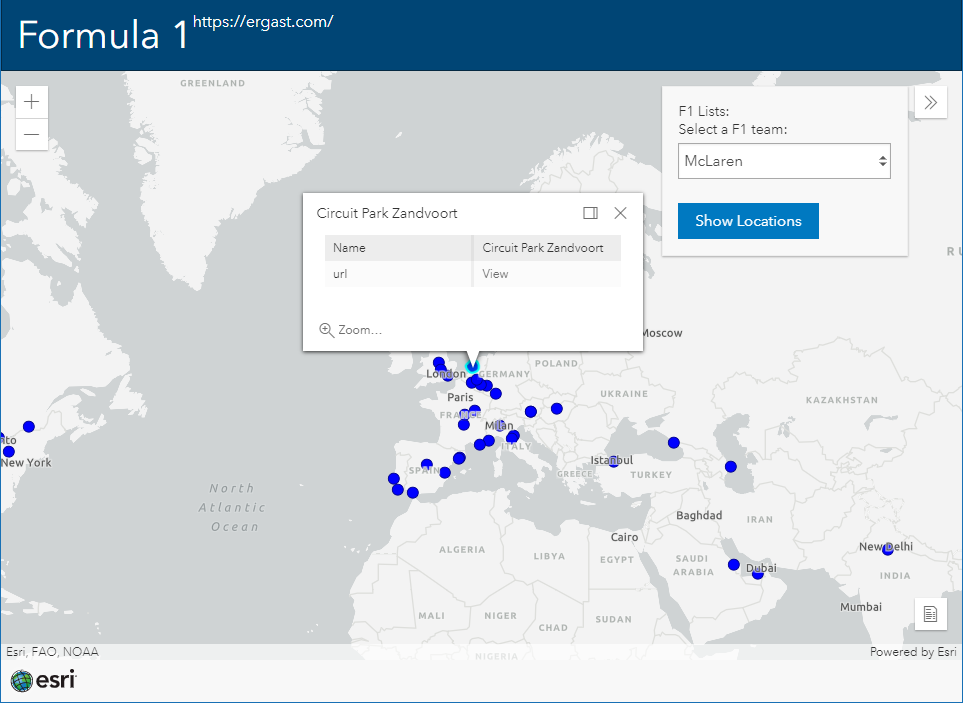

# F1 App

This app shows how to add data from external, non-geostandard API's.
This demo was part of the Integrate API's in ArcGIS Session from the GIS Tech 2021.

View the code here:
https://github.com/esrinederland/DevDay-2021/blob/main/APIs/F1.html

View the live sample here:
https://esrinederland.github.io/DevDay-2021/APIs/F1.html

View the complete presentation here:

[Integreer API's in ArcGIS](https://www.youtube.com/watch?v=bl-26Yxx3Jc)

