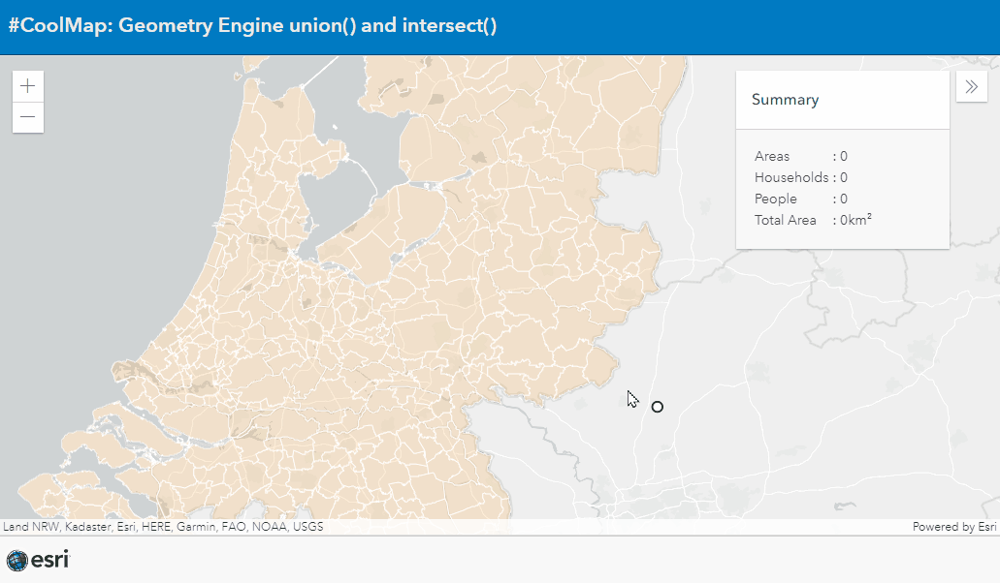
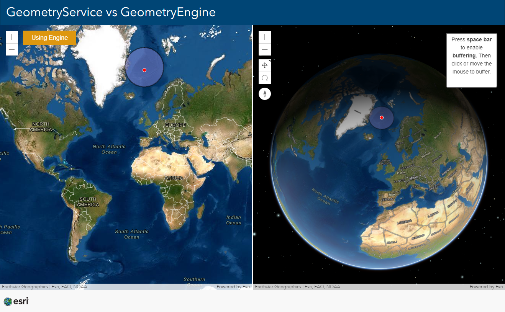

# GeometryEngine
These examples shows the power of the GeometryEngine.

## GeometryEngine Union 

See the GeometryEngine perform a buffer, a union and an intersect at the same time.

Also queries the LayerView to get geometries for the union.

See the live example [here](https://esrinederland.github.io/CoolMaps/GeometryEngine/GeometryEngine_union.html)

 

---

 
## GeometryService vs GeometryEngine

Toggle the button to switch between the use of the GeometryService and the GeometryEngine and see the difference in performance. 

View this example live:
[here](https://esrinederland.github.io/CoolMaps/GeometryEngine/GeometryEngine_vs_GeometryService.html)

View all functions of the GeometryEngine [here](https://developers.arcgis.com/javascript/latest/api-reference/esri-geometry-geometryEngine.html).