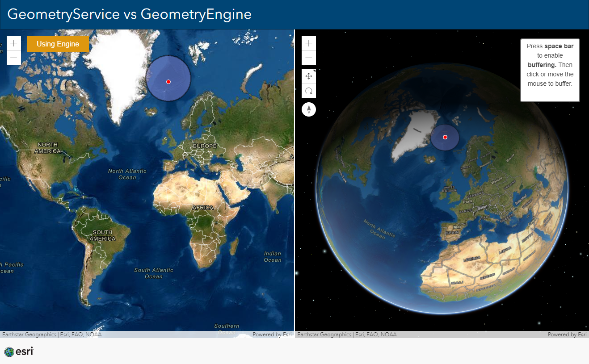

# GeometryService vs GeometryEngine

This example shows how the power of the GeometryEngine.

Toggle the button to switch between the use of the GeometryService and the GeometryEngine and see the difference in performance. 

View this example live:
[here](https://esrinederland.github.io/CoolMaps/GeometryEngine/geometryengine.html)

View all functions of the GeometryEngine [here](https://developers.arcgis.com/javascript/latest/api-reference/esri-geometry-geometryEngine.html).