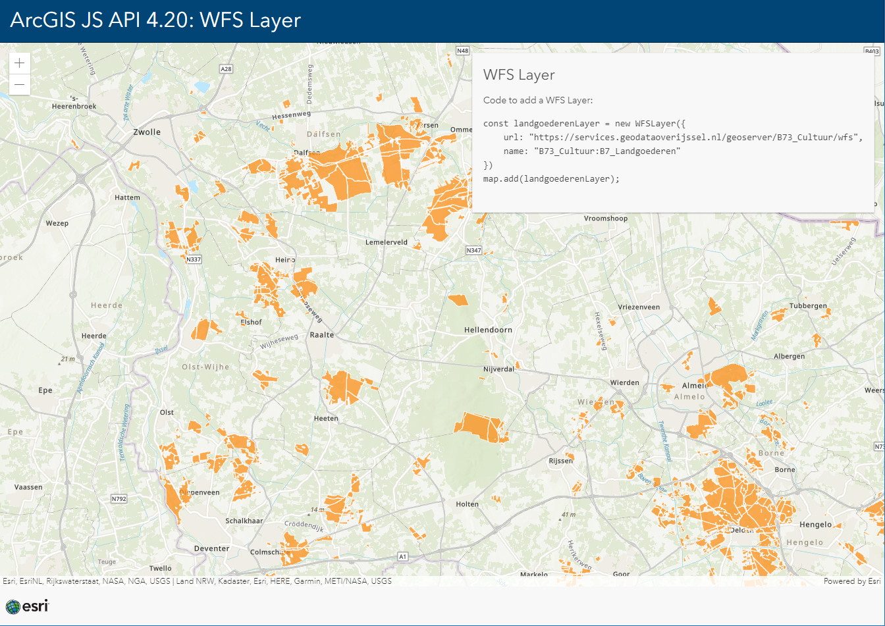

# ArcGIS API for JavaScript 4.20: WFS Layer

This sample shows how you can add a WFS Layer to you ArcGIS API application

 
 
View this example live:
[here](https://esrinederland.github.io/CoolMaps/JS420WFS/)

Learn more about ArcGIS API for JavaScript [here](https://developers.arcgis.com/js)
