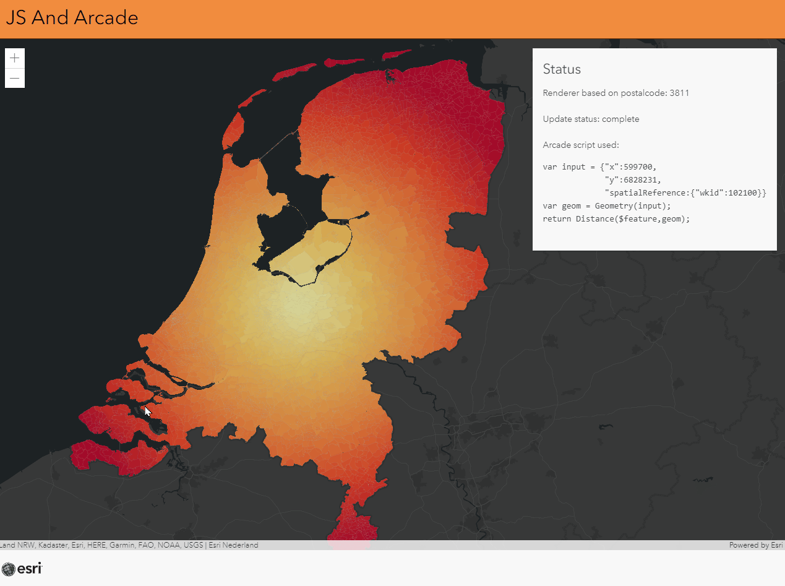

# JS And Arcade

This sample shows how you can combine JavaScript variables in Arcade expressions.

 
 
View this example live:
[here](https://esrinederland.github.io/CoolMaps/JSAndArcade/index.html)

Learn more about ArcGIS Arcade [here](https://developers.arcgis.com/arcade)
