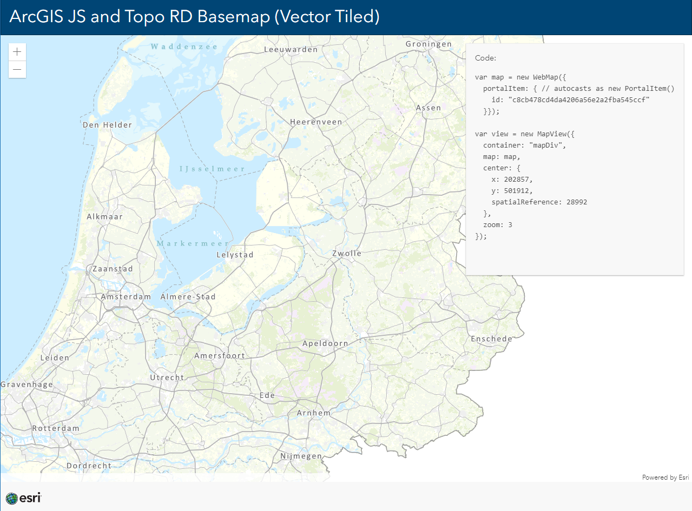
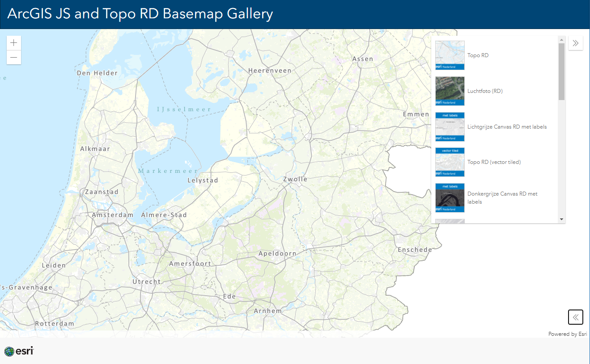
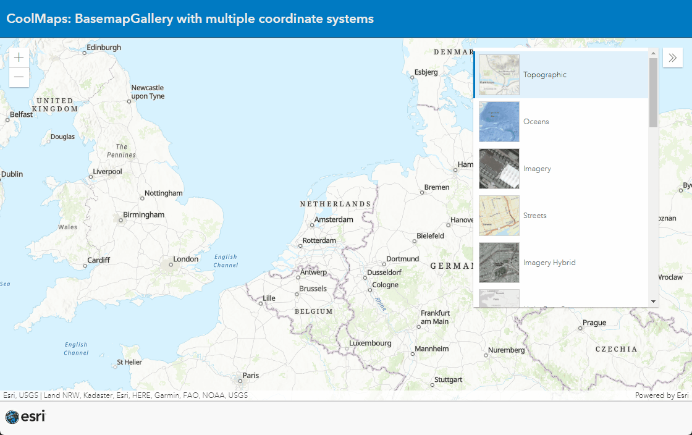

# JS And Topo RD Basemaps
This sample shows how you can use Basemaps in RD (wkid: 28992) in ArcGIS JS apps.

Use Topo RD Basemap in ArcGIS JS API App:

 
 
View this example live:
[here](https://esrinederland.github.io/CoolMaps/JSAndTopoRD/)

---

Use Topo RD Basemap Gallery in ArcGIS JS API App:

 
 
View this example live:
[here](https://esrinederland.github.io/CoolMaps/JSAndTopoRD/BasemapGallery.html)

---

Use Multiple Coordinate Systems in a BaseMap Gallery since the ArcGIS API for JavaScript 4.23

 
 
View this example live:
[here](https://esrinederland.github.io/CoolMaps/JSAndTopoRD/MultiCoordinateBasemapGallery.html)
