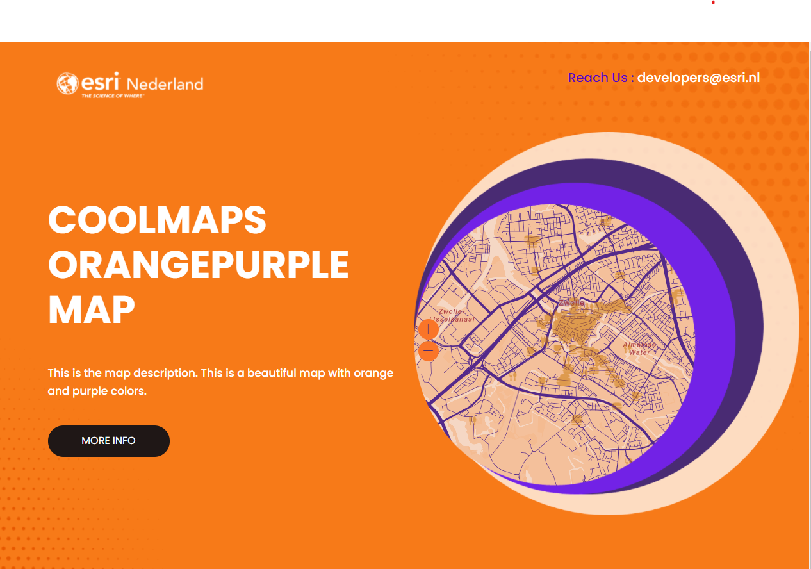

# ArcGIS JS As You Are
This sample shows how you can intergrate the ArcGIS API for JavaScript in your application, using your applications style.

The map is intergrated in the circle using CSS. 

The basemap style is adapted to the colors of the style of the website using the map styler: https://apps.arcgisonline.nl/mapstyler/

The zoom in and out buttons are styled according the same style of the website

The attribution of the map is shown on the bottom of the website.

When panning and zooming the map the numbers of how many of each type are in the map are updated.
 
 
View this example live:
[here](https://esrinederland.github.io/CoolMaps/JSAsYouAre/)
