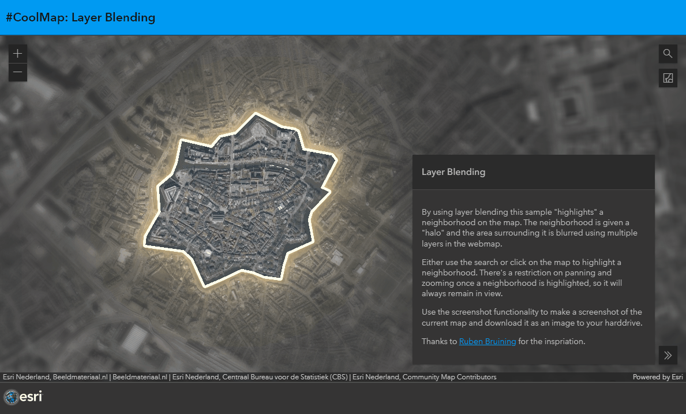
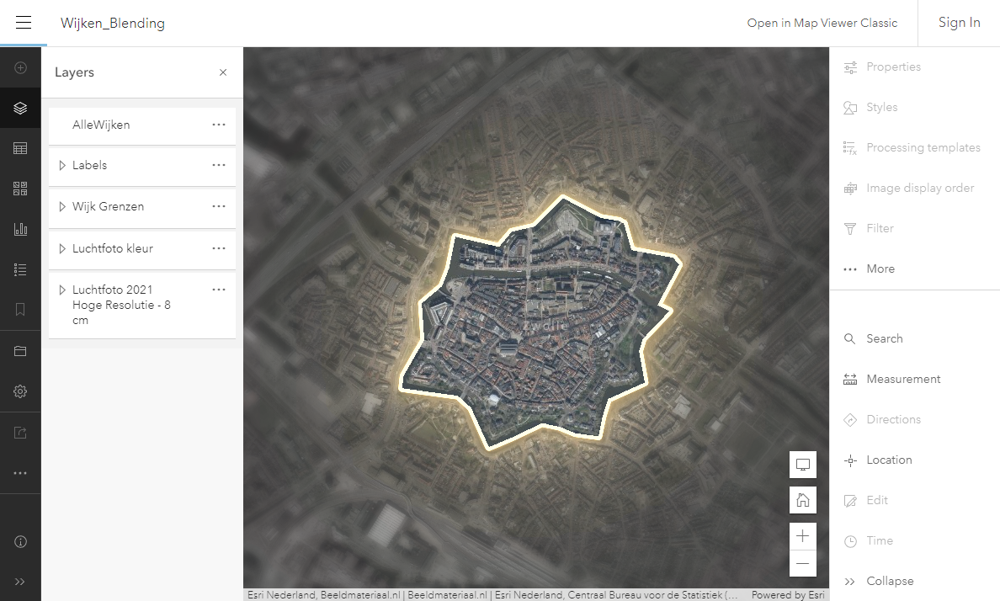

# Layer Blending
This sample shows how you can use layer blending to make stunning maps and how to use the screenshot function from the MapView.

 
 
Try example live:
[here](https://esrinederland.github.io/CoolMaps/LayerBlending/)

---

To learn more about layer blending see the [Intro into layer blending](https://developers.arcgis.com/javascript/latest/sample-code/intro-blendmode-layer/)

---

To view the webmap used in this application click [here](https://www.arcgis.com/apps/mapviewer/index.html?webmap=0e8a91bd0ab74e83b40e65472add4021)
 
 
View this original app with the City Center of Leiden from Ruben Bruijning :
[here](https://www.arcgis.com/apps/instant/basic/index.html?appid=858dceec6de145e78105dbbb2bf4e969)
