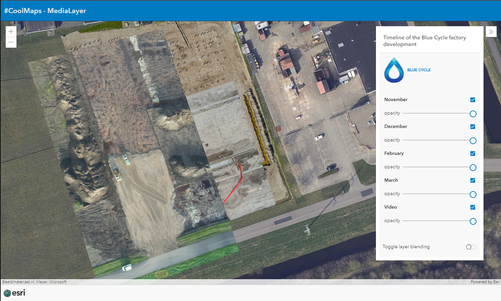

# Use the MediaLayer
This sample shows how to use the MediaLayer to add images and video to a map without having to add them as georeferenced objects to a specific layer. To get the images and video displayed at the correct location on the map, you add either an <b style='color:#3384E0'>ExtentAndRotationGeoreference</b> or a <b style='color:#3384E0'>CornersGeoreference</b> object to the media file.
 
 
You can find documentation on the MediaLayer on de Developer website: [https://developers.arcgis.com/javascript/latest/api-reference/esri-layers-MediaLayer.html](https://developers.arcgis.com/javascript/latest/api-reference/esri-layers-MediaLayer.html)
 
 
 

 
 
View this example live:
[here](https://esrinederland.github.io/CoolMaps/MediaLayer/MediaLayer.html)
