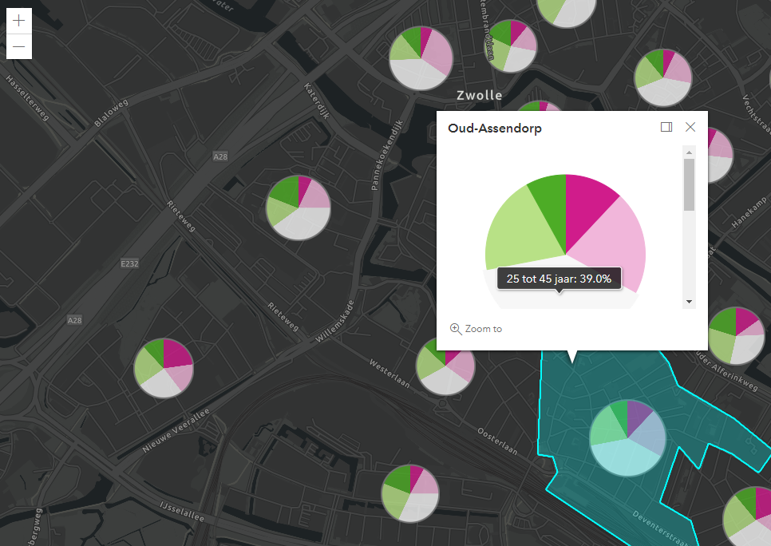

# PieChartRender

This sample app shows an implementation of the Pie Chart Renderer.

The PieChartRenderer allows you to visualize multiple attribute values of a feature point or polygon layer in a 2D Pie Chart for each feature.

## App

 
 
View this example live:
[here](https://esrinederland.github.io/CoolMaps/PieChartRendering/Index.html)
