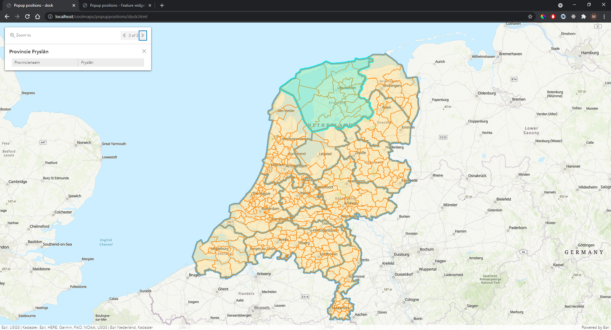
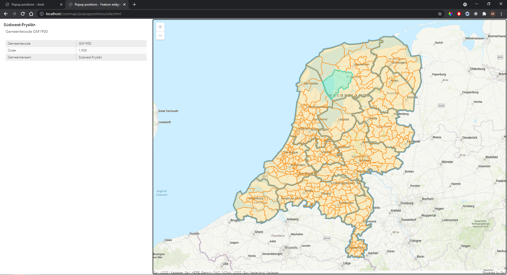

# Popup positions
These two samples show how you can show popup information in ArcGIS JS apps on other positions than the regular "at the feature location" position.

# Dock
The first sample shows how you can use dock positions to place the popup itself at a predefined position in the app. These position are "auto"|"top-center"|"top-right"|"top-left"|"bottom-left"|"bottom-center"|"bottom-right", much like you would position widgets in your app.

 
 
View this example live:
[here](https://esrinederland.github.io/CoolMaps/PopupPositions/dock.html)

---

# Feature Widget
The second example shows how you can use the Feature Widget to show popup information in any container in your application. So if you like to display the formatted content somewhere in your application outside the pop-up, you can use the Feature widget. The Feature widget renders information about a feature according to its PopupTemplate. In fact, under the hood, the pop-up uses the Feature widget internally to display content, and surrounds it with the pop-up UI such as the docking control and pagination. The Feature widget can be placed in any container (an HTMLElement, usually a DIV), on top of the map or completely outside the map. 

 
 
View this example live:
[here](https://esrinederland.github.io/CoolMaps/PopupPositions/side.html)
