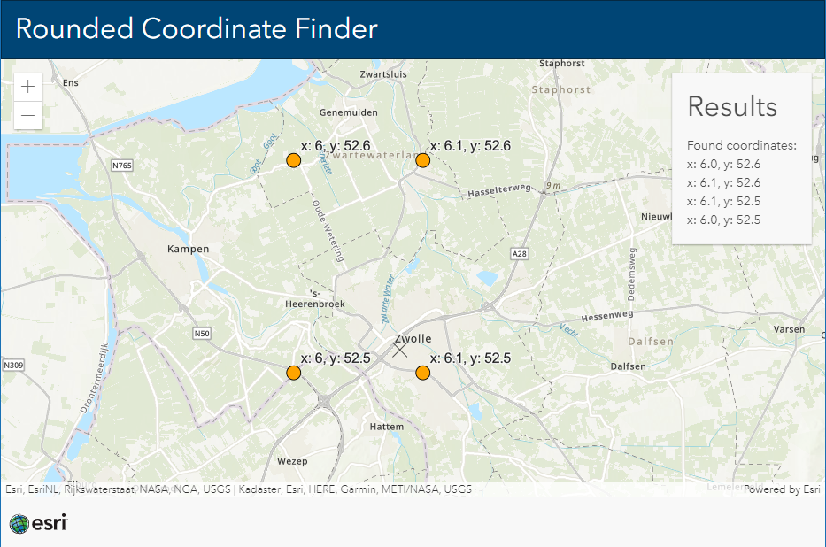

# Rounded Coordinate Finder
This application helps to find the closest one decimal rounded coordinate. This helps developers to quickly insert a coordinate to put a geometry on a place they know.

 
 
View this application live:
[here](https://esrinederland.github.io/CoolMaps/RoundedCoordinateFinder/)

