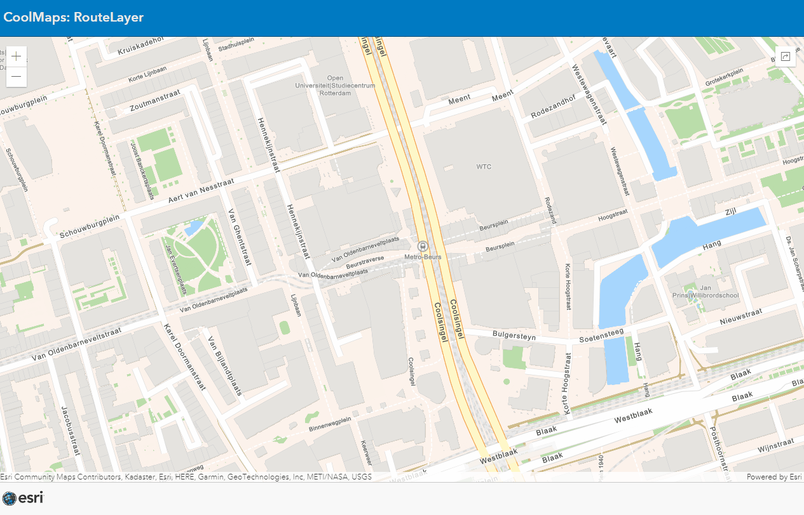

# RouteLayer
This sample shows the new (ArcGIS API for JS 4.23) RouteLayer
 
 
Click on the map and see the route layer calculate a route to the location of the Esri GIS Tech 2022.
 

 
 
View this example live:
[here](https://esrinederland.github.io/CoolMaps/RouteLayer/RouteLayer.html)
 
 
For more information on the RouteLayer see the [documentation](https://developers.arcgis.com/javascript/latest/api-reference/esri-layers-RouteLayer.html)
