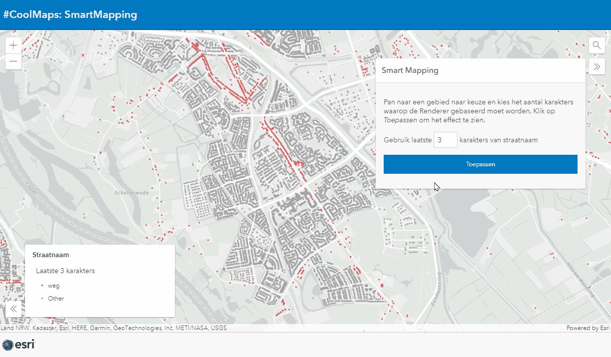

# Generate renderer using SmartMapping and Arcade
This sample shows how to use ArcGIS SmartMapping to dynamicly generate a renderer based on values of attributes.
 
 
 

 
 
View this example live:
[here](https://esrinederland.github.io/CoolMaps/SmartMapping/SmartMappingStreets.html)
 
 
For more information on SmartMapping visit: [developers.arcgis.com](https://developers.arcgis.com/javascript/latest/visualization/data-driven-styles/smart-mapping/)
