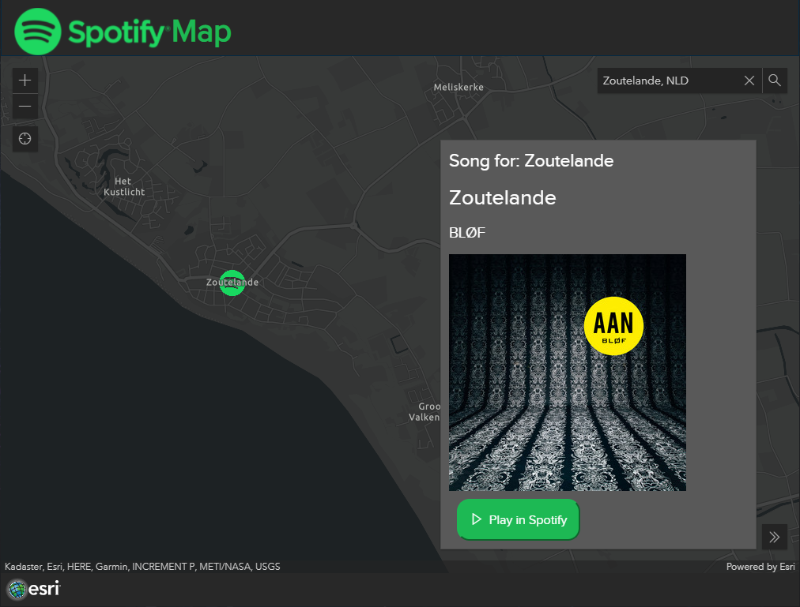

# Spotify Map

At the 2021 GIS Tech we hosted 3 sessions. In the session about using API's we showed how to use the Spotify API when creating a web app. The code for the Spotify Map can be found [here](https://github.com/esrinederland/DevDay-2021/blob/main/APIs/spotify.html) and this is the [live sample](https://esrinederland.github.io/DevDay-2021/APIs/spotify.html).

All sessions have been published to YouTube:

[ArcGIS Pro SDK](https://www.youtube.com/watch?v=vp0h5EvPL_8)

[Integreer API's in ArcGIS](https://www.youtube.com/watch?v=bl-26Yxx3Jc)

[ArcGIS Experience Builder - bouw uw eigen widgets](https://www.youtube.com/watch?v=QWbcj06c70o&t=1263s)

