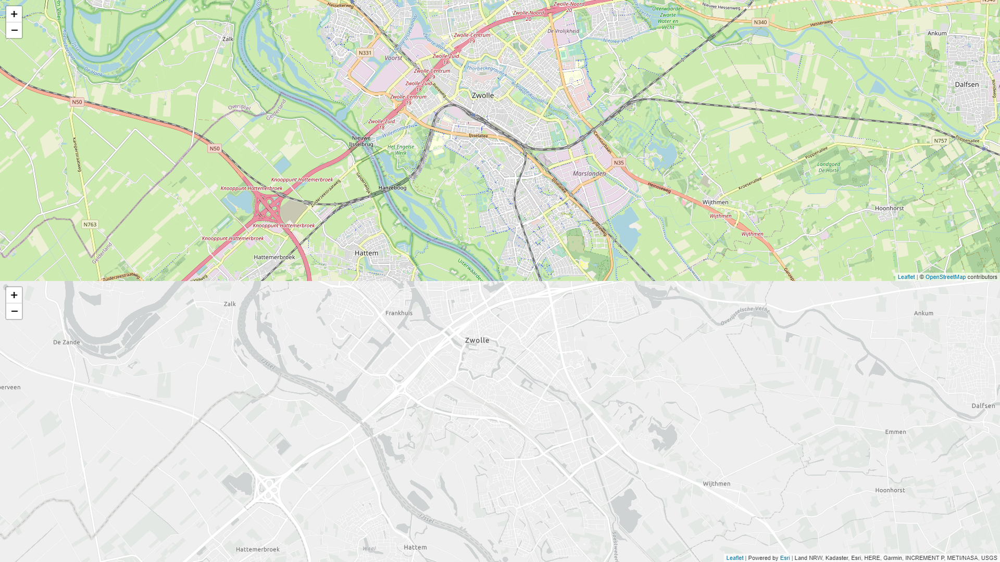
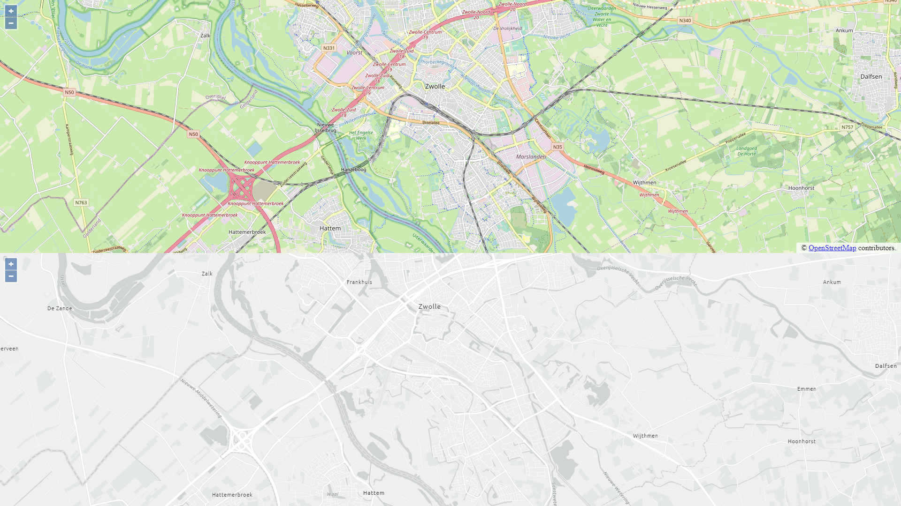
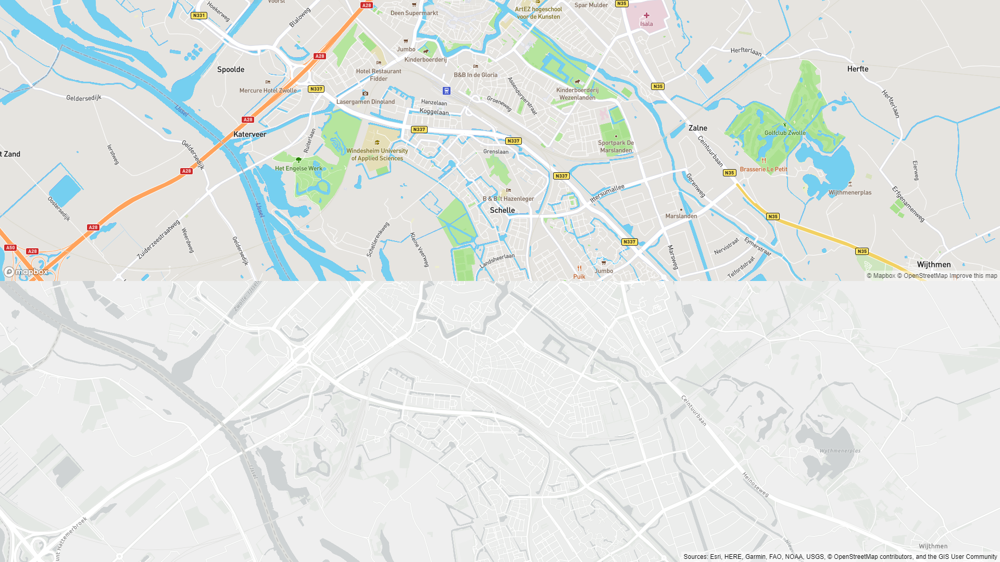
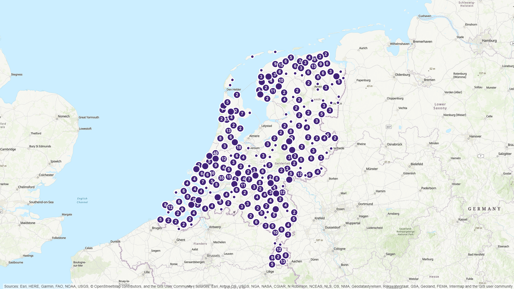
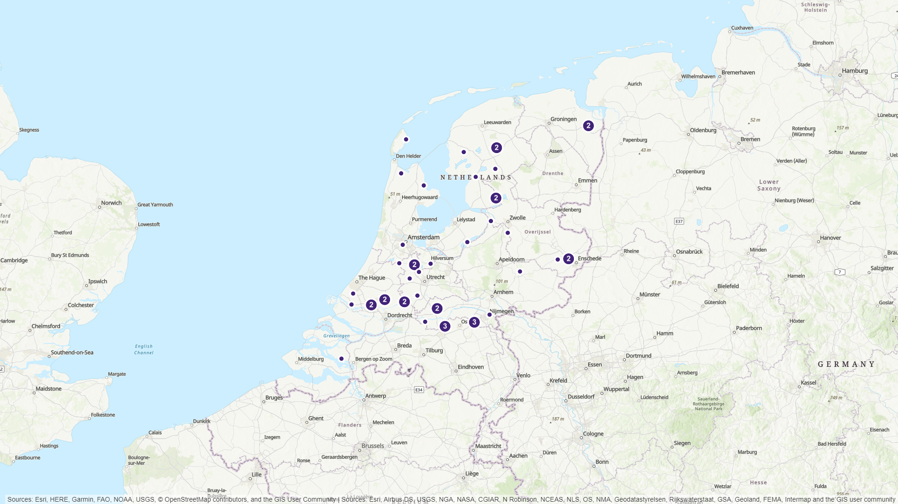

# Use Esri Basemaps and data with tird party web APIs
Since the release of ArcGIS Platform, Esri supports the use of API keys for accessing basemaps, geocoding and routing services and in the near future even your own secured services. On top of that it's also possible to use the Location Based Services in other (open source) front ends than the ones built with our own JavaScript API.
 
The API keys you create with your developer account can be set to support various operations. They always support the use of basemaps, but on top of that you can choose which capability to enable with each specific API key. Furthermore you can define a referer so the key can only be used from a spcific URL.
  
These samples show various applications built with third party web mapping APIs, that all use the same API key. This API key has been configured to not only allow the use of Esri basemaps (default), but also use a secured Hosted FeatureService created with a developer account.
  
The first 3 applications are similar, but all built with different third party web mapping APIs. The purpose of these apps is to show both the default way of using that third party API and it's basemaps, and the code you need to use the Esri basemaps. The result is one codebase that show both basemap options in a similar way, so you can easily compair what you need to alter to your code to make it work with Esri basemaps. 

 
View the example using Leaflet live: [here](https://esrinederland.github.io/CoolMaps/ThirdPartyWebAPIs/leaflet.html)
  

 
View the example using OpenLayers live: [here](https://esrinederland.github.io/CoolMaps/ThirdPartyWebAPIs/openlayers.html)
  

 
View the example using Mapbox live: [here](https://esrinederland.github.io/CoolMaps/ThirdPartyWebAPIs/mapbox.html)
  
The next 2 applications use Mapbox as web mapping API, but besides using the Esri basemap they also show data stored in Hosted FeatureServices.
 
The first sample app shows using public content provided by Esri Netherlands. In this case it's a layer containing Rijksmonumenten (monumental buildings), filtered by windmills. The app uses Mapbox clustering and popups to tidy up and provide extra value to the data shown on the map. When you click on a single windmill, a popup will show with a link to an external website containg information on these monumental windmills.
 

 
View the Mapbox example using public content live: [here](https://esrinederland.github.io/CoolMaps/ThirdPartyWebAPIs/mapbox_esrinl_content.html)
  
The second sample is identical to the first, but this one uses secured content stored with the developer account. By doing this, it becomes possible to use the secured data with an API key instead of an ArcGIS Identity. Unauthorized users will not be able to access that content other then through an API key. Because this key is visible in your JavaScript code, you still need to make sure yourself that unauthorized users will not be able to access the web page containing the map, by using your own authentication and authorization mechanism.
 

 
View the Mapbox example using private data live: [here](https://esrinederland.github.io/CoolMaps/ThirdPartyWebAPIs/mapbox_private_data.html)
  
To see how the API key can be used as a token to access a secured service, try these links:
 
Service inaccessable without token: [here](https://services6.arcgis.com/PJ2O5BaHcA2bnIXr/ArcGIS/rest/services/NonPublicPointLayer/FeatureServer/0?f=pjson)
 
Service accessable with token: [here](https://services6.arcgis.com/PJ2O5BaHcA2bnIXr/ArcGIS/rest/services/NonPublicPointLayer/FeatureServer/0?f=pjson&token=AAPKae3dab1f05f948b69237b3469b47aa40ccRlxQCH8occ_IBIyNrAhGtY9NaONVg54soZcUqSolmTHii1ZAZ8YFr6Dmf1AcHW)