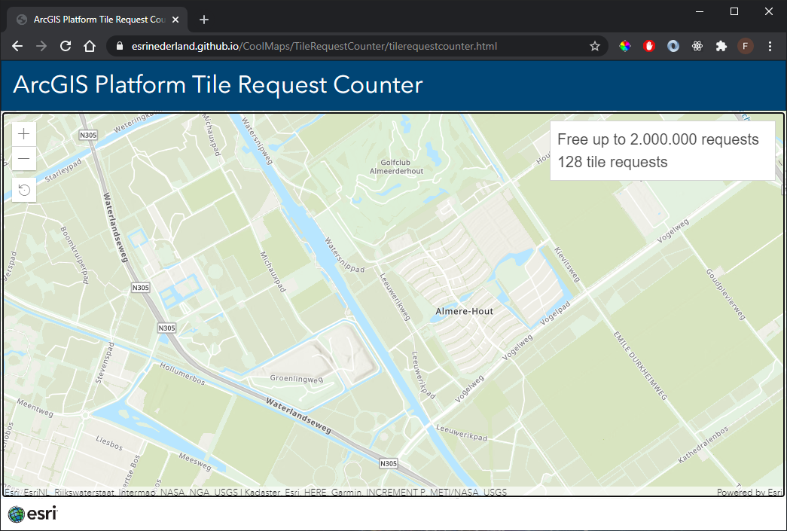

# Count tile requests on vector basemaps

In this sample app shows the number of Vector Tile requests an application makes when you pan and zoom. It is meant to give an indication so you know what to expect in usage when working with the new ArcGIS Platform and metering basemap services with API keys.

 
 
View this example live:
[here](https://esrinederland.github.io/CoolMaps/TileRequestCounter/index.html)
