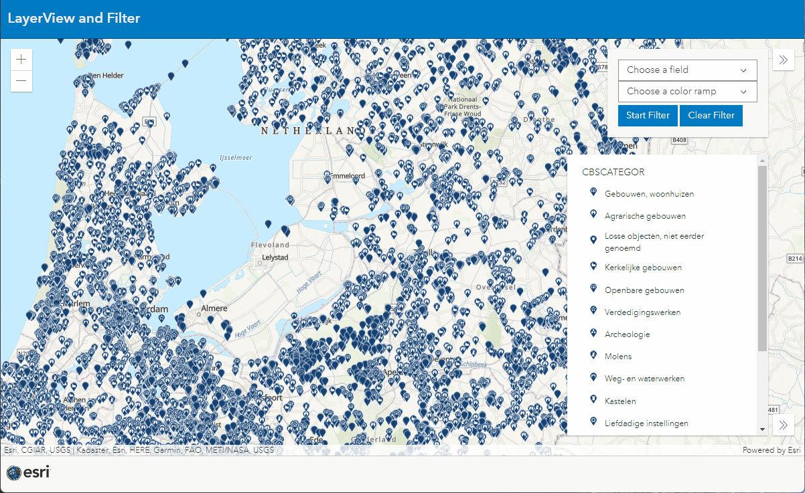

# LayerView and Filter 
This sample shows the power of the LayerViews in the ArcGIS API for JavaScript
 
 
In this demo it holds more than 63000 Features on the client and can switch rendering within an second. 
 
Also it can filter based on a geometry without querying the server.
 
 

 
 
View this example live:
[here](https://esrinederland.github.io/CoolMaps/ViewAndFilter/index.html)
