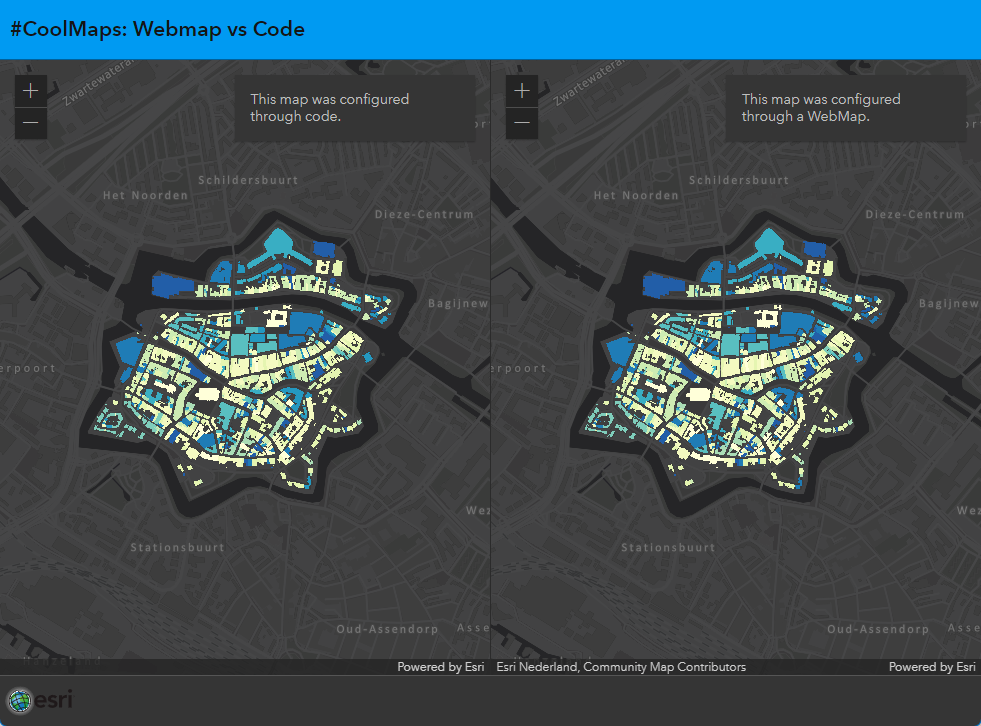

# WebMap vs Code
This sample shows the power of a webmap in custom applications. The left map is build in code, the renderer of the featurelayer alone takes more than 170 lines of code. And it does not even have a working popup. 

The right map takes only 8 lines of code for the complete map. Including popups. This is because it is based on a webmap. 

 
 
View this application live:
[here](https://esrinederland.github.io/CoolMaps/WebMapvsCode/webmapvscode.html)

