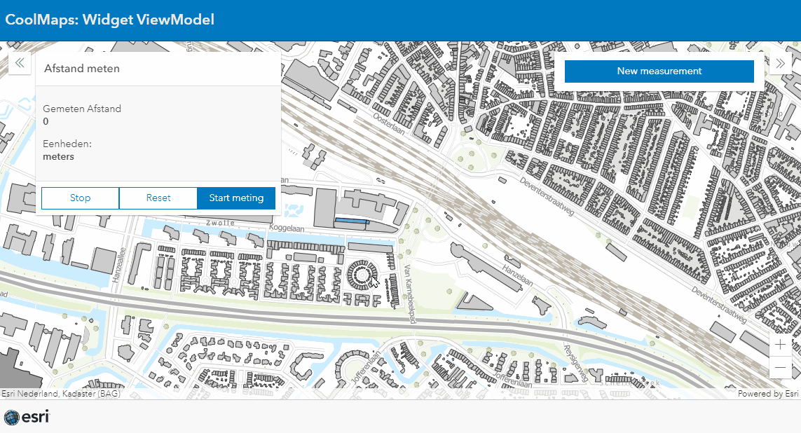

# Widgets ViewModel
This sample shows how to implement the viewmodel of an ArcGIS Widget in your own widget
 
 
 

 
 
View this example live:
[here](https://esrinederland.github.io/CoolMaps/WidgetViewModel/WidgetViewModel.html)
