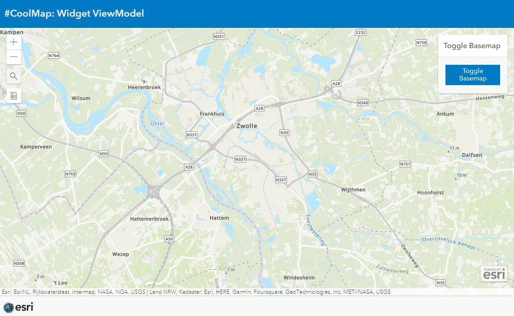

# Widgets ViewModel
This sample shows how to implement the viewmodel of an ArcGIS Widget in your own widget

View this example live:
[here](https://esrinederland.github.io/CoolMaps/WidgetViewModel/BaseMapToggleVM.html?ref=readme)

 

---
 

 
 
View this example live:
[here](https://esrinederland.github.io/CoolMaps/WidgetViewModel/WidgetViewModel.html?ref=readme)
