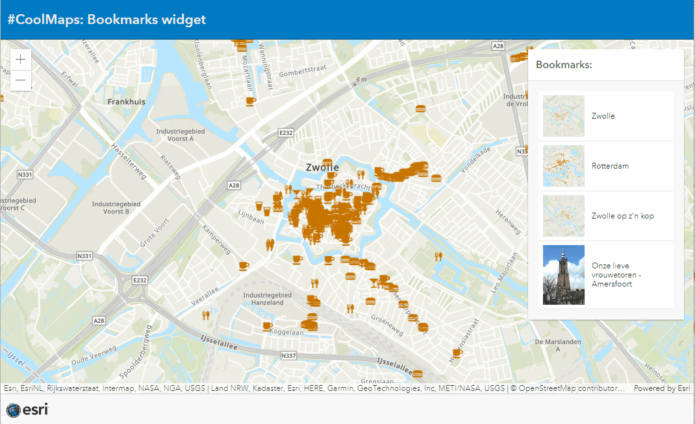

# Swipe
This sample shows how to manipulate the swipe widget into an autoswipe.

 
 
View this application live:
[here](https://esrinederland.github.io/CoolMaps/Widgets/AutoSwipe.html?ref=readme)

# Bookmarks
This sample shows how to use the bookmarks widget in an application.

 
 
View this application live:
[here](https://esrinederland.github.io/CoolMaps/Widgets/bookmarkwidget.html?ref=readme)

