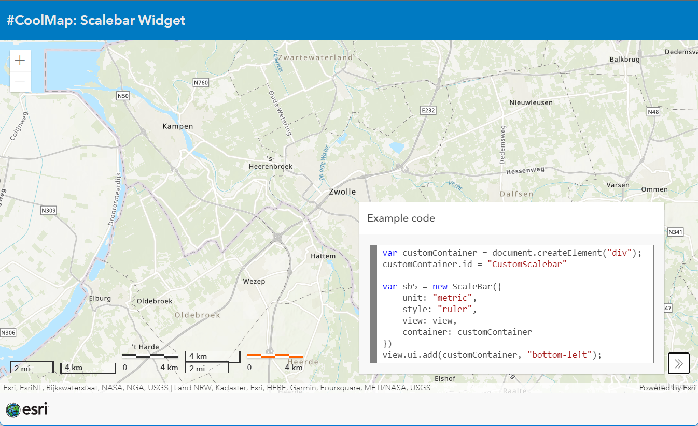

# Scalebar
This sample shows the different scalebar options and a way to customize the style of the scalebar.

 
 
View this sample live [here](https://esrinederland.github.io/CoolMaps/Widgets/ScalebarTypes.html?ref=readme)

---
 

# Magnifier
This sample shows how to use the [magnifier](https://developers.arcgis.com/javascript/latest/api-reference/esri-views-Magnifier.html) that is embeded in the [MapView](https://developers.arcgis.com/javascript/latest/api-reference/esri-views-MapView.html#magnifier).

 
 
View this application live:
[here](https://esrinederland.github.io/CoolMaps/Widgets/Magnifier.html?ref=readme)

---
 

# Swipe
This sample shows how to manipulate the swipe widget into an autoswipe.

 
 
View this application live:
[here](https://esrinederland.github.io/CoolMaps/Widgets/AutoSwipe.html?ref=readme)

---
 

# Bookmarks
This sample shows how to use the bookmarks widget in an application.

 
 
View this application live:
[here](https://esrinederland.github.io/CoolMaps/Widgets/bookmarkwidget.html?ref=readme)

